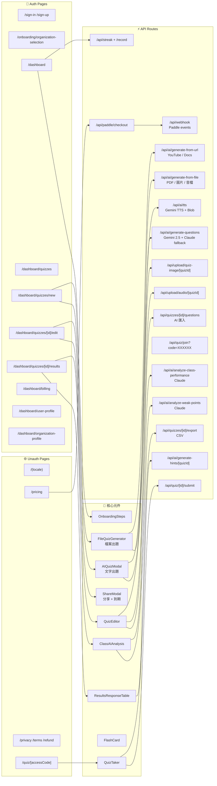
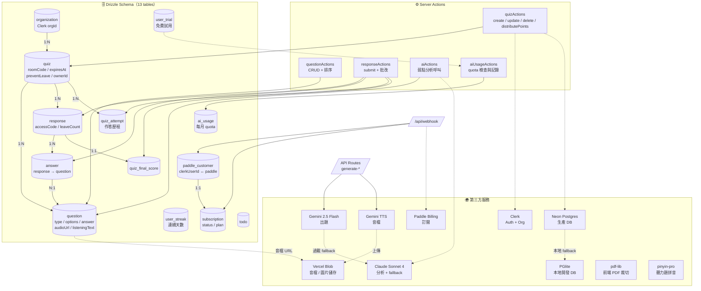

# QuizFlow 流程圖（三層）

> 用 Figma / FigJam 的「Mermaid」外掛可直接貼上渲染（例：`Mermaid to Figma`、`FigJam Mermaid`）。

---

## Layer 1 — 使用者旅程（User Journey）

```mermaid
flowchart TB
  %% 老師流程
  subgraph Teacher["👩‍🏫 老師端"]
    T1([訪問首頁]) --> T2[註冊 / 登入<br/>Clerk]
    T2 --> T3[建立 Organization<br/>onboarding]
    T3 --> T4[Dashboard 首頁<br/>統計 + 最近測驗]
    T4 --> T5{建立新測驗}
    T5 -->|手動| T6[QuizEditor<br/>手動新增題目]
    T5 -->|AI 文字出題| T7[AIQuizModal<br/>輸入主題 + 選題型]
    T5 -->|AI 檔案出題| T8[FileQuizGenerator<br/>PDF / 圖片 / 音檔]
    T5 -->|YouTube / Docs| T9[URL 出題<br/>抓字幕 / 文件]
    T7 --> T10[生成題目 + 配分]
    T8 --> T10
    T9 --> T10
    T6 --> T10
    T10 --> T11[編輯 / 排序 / 插圖<br/>平均配分總分 100]
    T11 --> T12[ShareModal<br/>房間碼 + LINE + Classroom + QR]
    T12 --> T13[學生作答 收集中]
    T13 --> T14[成績頁<br/>可排序表格 + CSV]
    T14 --> T15[AI 班級建議<br/>弱點分析]
  end

  %% 學生流程
  subgraph Student["🧑‍🎓 學生端（免登入）"]
    S1([取得房間碼<br/>或 QR / 連結]) --> S2[/quiz/[accessCode]<br/>QuizTaker]
    S2 --> S3{作答模式}
    S3 -->|一般| S4[填答題目]
    S3 -->|聽力題| S5[播放音檔 + 選答]
    S3 -->|快閃卡複習| S6[3D 翻牌]
    S4 --> S7[提交答案<br/>自動批改]
    S5 --> S7
    S7 --> S8[成績頁 + 解析]
    S8 --> S9[AI 弱點分析]
    S8 --> S10[錯題重做<br/>不計入統計]
  end

  %% 跨端關聯
  T13 -.房間碼/連結.-> S1
```

---

## Layer 2 — 功能架構（Pages / APIs / Modals）



---

## Layer 3 — 資料流（Schema / Actions / 第三方服務）



---

## 匯入 Figma 的步驟

1. 打開 Figma / FigJam 檔案
2. 安裝外掛（任一即可）：
   - **FigJam Mermaid**（官方，推薦）
   - **Mermaid to Figma**
3. 複製上面 ```` ```mermaid ... ``` ```` 區塊內的程式碼
4. 執行外掛 → 貼上 → 渲染
5. 調整顏色／字型 → 匯出 PNG / SVG

---

## 小提醒

- 三張圖**可分開貼**，每張獨立匯入比較好整理版面
- 若要給**投資人／合作夥伴**看，建議只用 Layer 1（乾淨）
- 若要給**新工程師 onboarding**，Layer 2 + Layer 3 最有用
- 實際流程會隨 commit 變動，此文件寫於 2026-04-17
